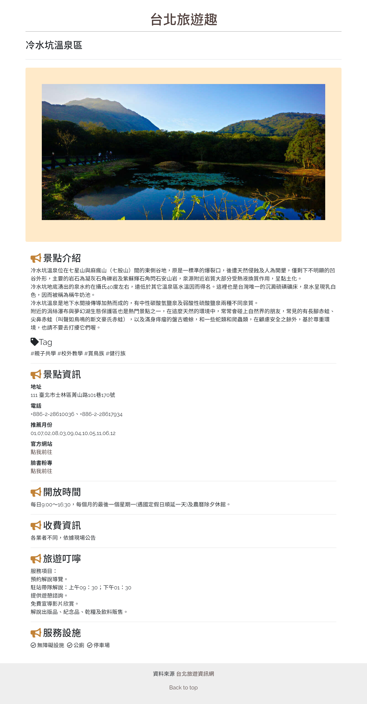

# 台北旅遊趣

----
## 簡介
資料來源 [台北旅遊網](https://www.travel.taipei/)

> 串接台北旅遊網api(景點部分)，主要呈現兩個頁面:景點列表頁、景點資訊頁

----
## 頁面介紹
* 列表頁

    
   > 上方分類選單採水平捲動，點擊卡片可前往景點資訊頁

* 景點資訊頁

   > 景點資訊最下方back to top可回到頁面上方，點擊標題台北旅遊趣回到列表頁

----
## 使用技術

> html、css、Bootstrap、javascript、axios、jQuery

